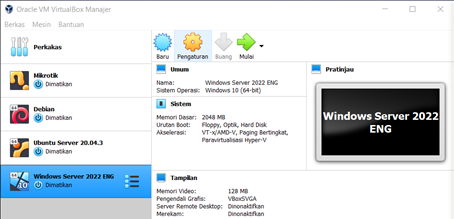

# STEPS OF WINDOWS SERVER 2022 INSTALLATION
## By Nur Wulan Maudini - 1202190002 - IT-02-01

#
Download ISO Installer windows server 2022 [Click here.](https://www.microsoft.com/en-us/evalcenter/evaluate-windows-server-2022)
#
##
## Number 1. 
- ## Open Virtual Box and go to the “Machine - New” menu

#
## Number 2. 
- ## Enter the name of the machine and type of system to use

#
## Number 3. 
- ## Define RAM
- ## Create the disk definining type and size

#
## Number 4. 
- ## Go to the machine configuration and in the “Network” section set “Bridge adapter”

#
## Number 5.
- ## Click on “Start” and select the ISO downloaded

#
## Number 6.
- ## Click on “Start” and the Windows Server 2022 installation wizard will load

#
## Number 7. 
- ## Click on “Install now”
[A1](assets/Picture16.png)
#
## Number 8. 
- ## Enter the license (if you have one) and then define the edition to use
- ## Accept the license and then proceed with the installation of Windows Server 2022

#
## Number 9. 
- ## Custom: Install Windows only (advanced)

#
## Number 10. 
- ## The system will reboot to complete the process

#
## Number 11. 
- ## Enter the administrator password

#
## Number 12. 
- ## Access the menu “Input – Keyboard – Insert Ctrl + Alt + Del”
- ## Enter the password created and wait for the configuration to load

#
## Number 13. 
- ## Klik Yes and minimize

#
## Number 14. 
- ## Go to the menu “Device – Insert Guest Additions CD Image” 
- ## From the Explorer run this and follow the steps of the wizard
- ## Reboot the machine

#
## Number 15. 
- ## You can maximize the machine and it will be in full screen format
- ## Run “winver” to validate the installed edition of Windows Server

