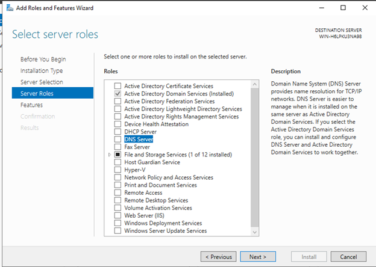
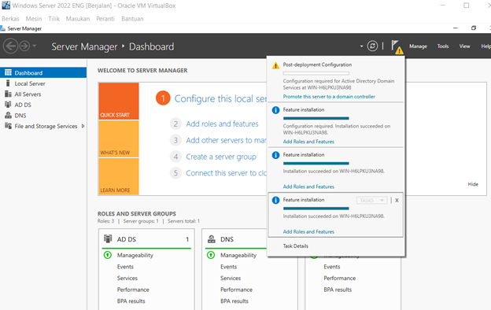

# Instalasi Active Directory Domain Services

Ubah nama computer di windows powershell dengan mengetik > “rename-computer -Newname Server2022”

Kemudian masuk ke server manager pilih menu manage

Kemudian pilih Add Roles and Features dan next

Pilih Role-Based or feature-based installation kemudian next

Setelah itu pilih select a server from the server pool

Lalu pilih active directory domain server

Kemudain klik add features and next

Kemudian ke features lalu centang Group Policy Management dan next

Install

Setting ip static di cmd menggunakan command> sconfig

Pilih 8

Pilih 1

Setting IP menjadi 192.168.1.10

# INSTALLASI DNS
Kemudian install DNS server sama seperti menginstal domain
16

17

18

# INSTALLASI NET FRAMEWORK 3.5

# Promote Server to a Domain Controller
Kemudian Promote Server to a Domain Controller dengan menekan tanda seru

Pilih add new forest dan beri nama

